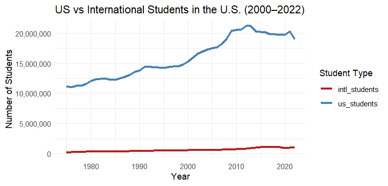
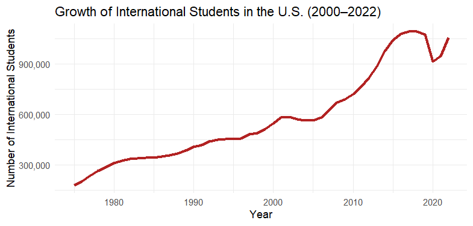
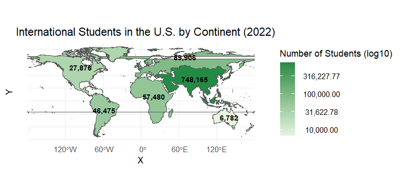
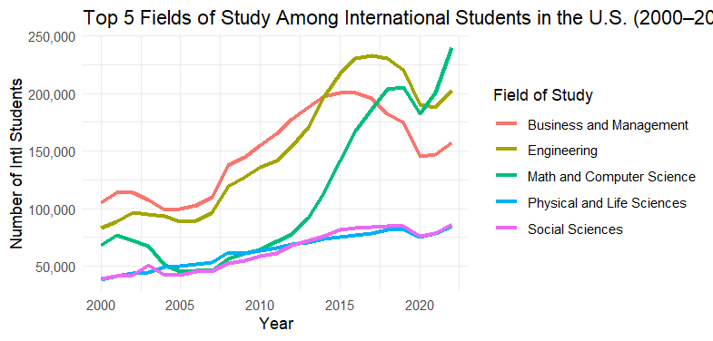
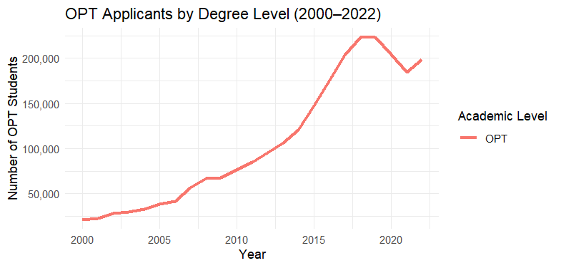
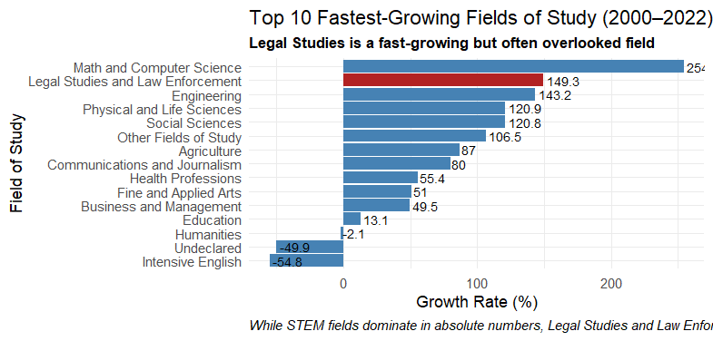
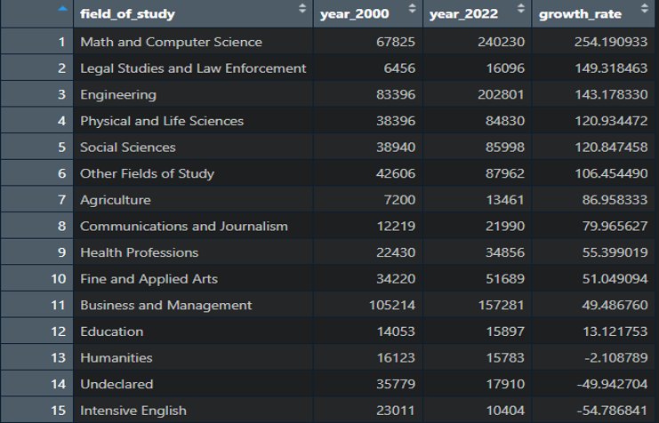
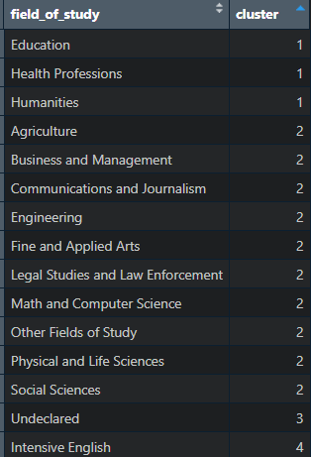
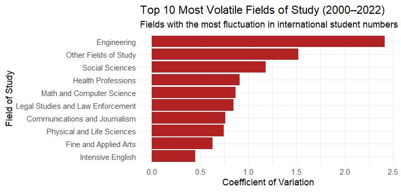

# INTERNATIONAL STUDENTS IN THE U.S. 🧑‍🎓🌎

## Problem Statement and Questions Addressed
The goal of this project is to analyze international student trends in the United States from 2000 to 2022. As international students play a crucial role in shaping university demographics and labor market dynamics, in this study I will answer the following questions:

1.	How does international student enrollment compare to U.S. student enrollment?
2.	From which continents do most international students come from?
3.	Which fields of study are the most common among international students?
4.	Which academic areas are driving OPT (Optional Practical Training) participation?
5.	What hidden trends exist in terms of field growth, volatility, or shifts in student preferences?
6.	What fields of study follow a similar trend pattern?
7.	Which are the most unstable or volatile fields of study among international students?


## Data Source 🗂️
The dataset used in this analysis was obtained from Kaggle (https://www.kaggle.com/datasets/webdevbadger/international-student-demographics?select=origin.csv), which includes information about international student demographics in the United States. In this Kaggle dataset you can find multiple CSV files covering student academic data, origins, funding sources, and visa status. The original data source is Open Doors (https://opendoorsdata.org/data/international-students/), a project by the Institute of International Education (IIE), which tracks international student trends in the U.S. over time.

The six datasets are:

### - Academic.csv

year: The year. The format is YYYY/YY.

students: The number of students.

us_students: The number of non-international students.

undergraduate: The number of undergraduate students.

graduate: The number of graduate students.

non_degree: The number of non-degree students.

opt: The number of OPT students. OPT stands for Optional Practical Training.


### - Academic_detail.csv

year: The year. The format is YYYY/YY.

academic_type: The academic type. One of ["Undergraduate", "Graduate", "Non-Degree", "OPT"],

academic_level: The academic level. One of ["Associate's", "Bachelor's", "Master's", 'Doctoral',"Professional", "Graduate, Unspecified","Non-Degree, Intensive English", "Non-Degree, Other", "OPT"].

students: The number of students.


### - Field_of_study.csv

year: The year. The format is YYYY/YY.

field_of_study: The field of the study.

major: The major of the study.

students: The number of students.


### - Origin.csv

year: The year. The format is YYYY/YY.

origin_region: The region of origin, such as Asia, Europe, and North America.

origin: The origin, such as Canada, China, and India.

academic_type: The academic type. One of ["Undergraduate", "Graduate", "Non-Degree", "OPT"].

students: The number of students.


### - Source_of_fund.csv

year: The year. The format is YYYY/YY.

academic_type: The academic type. One of ["Undergraduate", "Graduate", "Non-Degree", "OPT"].

source_type: The fund source type. One of ["International", "U.S.", "Other"].

source_of_fund: The source of fund. One of [ "Personal and Family", "Foreign Government or University", "Foreign Private Sponsor", "International Organization", "Current Employment", "U.S. College or University", "U.S. Government", "U.S. Private Sponsor", "Other Sources"].

students: The number of students.


### - Status.csv

year: The year. The format is YYYY/YY.

female: The number of female students.

male: The number of male students.

single: The number of non-married students.

married: The number of married students.

full_time: The number of full-time students.

part_time: The number of part-time students.

visa_f: The number of students with F Visa.

visa_j: The number of students with J Visa.

visa_other: The number of students with other types of Visas.


## Data Cleaning 🧹

For this project, I have used R studio to clean, analyze and visualize the data. These are the steps I followed to clean the data:

- Narrowed the data to only the last century as there were too many missing values in the last century
- Changed the year column form the academic year to only the year
- Removed duplicates
- Get rid of NA values
- After that the data was cleaned, and I didnt have to spend too much time to clean it as the datasets were almost cleaned from 2000 to 2022
```
##Cleaning academic data (changing the academic year to the year)
academic_data_clean <- academic_data %>%
  rename_all(tolower) %>%
  mutate(year = str_sub(year, 1, 4) %>% as.numeric())  #Extract start year as integer

any(duplicated(academic_data_clean)) #no duplicates


##Cleaning academic detail data (changing the academic year to the year)
academic_detail_data_clean <- academic_detail_data %>%
  rename_all(tolower) %>%
  mutate(year = str_sub(year, 1, 4) %>% as.numeric())

any(duplicated(academic_detail_data_clean)) #no duplicates


##Cleaning field of study data (changing the academic year to the year)
field_of_study_data_clean <- field_of_study_data %>%
  rename_all(tolower) %>%
  mutate(year = str_sub(year, 1, 4) %>% as.numeric())

any(duplicated(field_of_study_data_clean)) #no duplicates

field_of_study_data_clean <- field_of_study_data_clean %>%
  filter(!is.na(students)) #removing NA


##Cleaning origin data (changing the academic year to the year)
origin_data_clean <- origin_data %>%
  rename_all(tolower) %>%
  mutate(year = str_sub(year, 1, 4) %>% as.numeric())

any(duplicated(field_of_study_data_clean)) #no duplicates


##Cleaning source of fund data (changing the academic year to the year)
source_of_fund_data_clean <- source_of_fund_data %>%
  rename_all(tolower) %>%
  mutate(year = str_sub(year, 1, 4) %>% as.numeric())

any(duplicated(source_of_fund_data_clean)) #no duplicates


##Cleaning status data (changing the academic year to the year)
status_data_clean <- status_data %>%
  rename_all(tolower) %>%
  mutate(year = str_sub(year, 1, 4) %>% as.numeric())

any(duplicated(source_of_fund_data_clean)) #no duplicates
```


## Data Merging 🔗

- Combined academic_data_clean and status_data_clean by year to bring together enrollment data with visa type, gender, and student status (full-time/part-time).

- Grouped and summarized origin_data_clean by year and continent, transforming regional origin data into a higher-level continent view for trend analysis.

- Extracted OPT participation trends from academic_detail_data_clean by filtering for academic_type == "OPT" and grouping by academic level (e.g., Bachelor's, Master's).

- Identified top fields of study across all students using field_of_study_data_clean, grouped by year to observe longitudinal popularity trends.

- Summarized OPT funding sources from source_of_fund_data_clean, highlighting how OPT students support their stay in the U.S. (e.g., through employment, personal funds).
```
#DATA MERGING

##Merge status_data_clean into academic_data_clean by year 
combined_data <- academic_data_clean %>%
  left_join(status_data_clean, by = "year") #This will bring in gender, visa type, and full-time/part-time status.


##Merge in summarized origin_data_clean by year
origin_summary <- origin_data_clean %>%
  mutate(year = str_sub(year, 1, 4) %>% as.numeric()) %>%
  mutate(continent = case_when(
    origin_region %in% c("East Asia", "South and Central Asia", "Southeast Asia", "Central Asia", "Asia") ~ "Asia",
    origin_region %in% c("North Africa", "West Africa", "East Africa", "Central Africa", "Southern Africa", "Africa, Subsaharan", "Africa") ~ "Africa",
    origin_region %in% c("North America") ~ "North America",
    origin_region %in% c("South America") ~ "South America",
    origin_region %in% c("Oceania") ~ "Oceania",
    origin_region %in% c("Europe") ~ "Europe",
    origin_region == "Stateless" ~ "Stateless",
    origin_region %in% c("Middle East", "Mexico and Central America", "Caribbean", "Latin America and Caribbean") ~ "Other",
    TRUE ~ "Other"
  )) %>%
  group_by(year, continent) %>%
  summarise(origin_students = sum(students, na.rm = TRUE)) %>%
  ungroup()  #Continent-level info over time. Let's summarize by origin_region.


##Get OPT data by level from academic_detail_data_clean
opt_by_level <- academic_detail_data_clean %>%
  filter(academic_type == "OPT") %>%
  group_by(year, academic_level) %>%
  summarise(opt_students = sum(students, na.rm = TRUE)) %>%
  ungroup()  #I want to find how many students use their OPT


##Get top OPT fields from field_of_study_data_clean
top_fields_by_year <- field_of_study_data_clean %>%
  group_by(year, field_of_study) %>%
  summarise(total_students = sum(students, na.rm = TRUE)) %>%
  arrange(desc(total_students)) %>%
  ungroup()  #relevant major for ALL students


##Get OPT funding from source_of_fund_data_clean
opt_funding_summary <- source_of_fund_data_clean %>%
  filter(academic_type == "OPT") %>%
  group_by(year, source_of_fund) %>%
  summarise(opt_fund_students = sum(students, na.rm = TRUE)) %>%
  ungroup()
```


## Data Visualization 📊

 ### 1.	How does international student enrollment compare to U.S. student enrollment?





- The first graph compares U.S. vs. international student enrollment from 2000–2022, showing that while international students are a small percentage, their presence has been steadily increasing.

- The second graph isolates the international student trend, highlighting sharp growth between 2010 and 2017, a drop during the pandemic (2020), and signs of recovery afterward.

- The COVID-19 pandemic caused a visible dip in international enrollment, but the upward trend resumed by 2022.

```
##Line Plot — U.S. vs International Students
#New column for international students
us_vs_intl_comparison <- combined_data %>%
  filter(year >= 1975) %>%
  select(year, us_students, students) %>%
  pivot_longer(cols = c(us_students, students), names_to = "student_type", values_to = "count")

#Changing the names
us_vs_intl_comparison$student_type <- recode(us_vs_intl_comparison$student_type,
                                             "students" = "intl_students",
                                             "us_students" = "us_students")

#US vs Intl Plot
ggplot(us_vs_intl_comparison, aes(x = year, y = count, color = student_type)) +
  geom_line(linewidth = 1.2) +  #Use linewidth instead of size (to avoid warning)
  scale_color_manual(values = c("us_students" = "steelblue", "intl_students" = "firebrick")) +
  labs(
    title = "US vs International Students in the U.S. (2000–2022)",
    x = "Year", y = "Number of Students", color = "Student Type"
  ) +
  theme_minimal() + scale_y_continuous(labels = scales::comma)

#Intl plot
ggplot(combined_data %>% filter(year >= 1975), aes(x = year, y = students)) +
  geom_line(color = "firebrick", linewidth = 1.2) +
  scale_y_continuous(labels = scales::comma) +
  labs(
    title = "Growth of International Students in the U.S. (2000–2022)",
    x = "Year", y = "Number of International Students"
  ) +
  theme_minimal()
```


### 2.	From which continents do most international students come from?


- Asia dominates international student presence in the U.S., with over 748,000 students in 2022 — more than all other continents combined.

- Africa and Europe follow with 57,000 and 89,000 students respectively, showing moderate representation.

- The logarithmic scale helps make smaller contributions from continents like Oceania and South America visible despite Asia’s overwhelming dominance.

```
library(rnaturalearth)
library(rnaturalearthdata)
library(sf)

##Get world continent geometries
world <- ne_countries(scale = "medium", returnclass = "sf")

#Add a continent column
continent_map <- world %>%
  group_by(continent) %>%
  summarise(geometry = st_union(geometry)) %>%
  ungroup()

#Prepare data from origin_summary
#Use only the most recent year (2022)
continent_students <- origin_summary %>%
  filter(year == max(year)) %>%
  group_by(continent) %>%
  summarise(origin_students = sum(origin_students, na.rm = TRUE))

#Merge map with student data
continent_map_merged <- continent_map %>%
  left_join(continent_students, by = "continent")

#Calculate a centroid (midpoint) for each continent
library(sf)
library(scales)
label_data <- continent_map_merged %>%
  st_centroid() %>%
  cbind(st_coordinates(.)) %>%
  mutate(label = format(origin_students, big.mark = ",", scientific = FALSE))


#Plot the worldmap
ggplot(continent_map_merged) +
  geom_sf(aes(fill = log10(origin_students + 1))) +
  scale_fill_gradient(
    low = "#e5f5e0",
    high = "#238b45",
    labels = function(x) format(10^x, big.mark = ",", scientific = FALSE),
    name = "Number of Students (log10)"
  ) +
  geom_text(
    data = label_data,
    aes(x = X, y = Y, label = label),
    color = "black",
    size = 3,
    fontface = "bold"
  ) +
  labs(
    title = "International Students in the U.S. by Continent (2022)",
    fill = "Number of Students (log10)"
  ) +
  theme_minimal()
```

### 3.	Which fields of study are the most common among international students?



- Math and Computer Science saw the most dramatic rise, especially after 2010, becoming the top field by 2022.

- Engineering and Business & Management consistently attracted high numbers, though Business saw a decline after 2016.

- Physical and Life Sciences and Social Sciences remained stable but with slower growth, rounding out the top five.

```
#Identify the top 5 fields overall (based on total students across all years
top_fields <- field_of_study_data_clean %>%
  filter(year >= 2000) %>%
  group_by(field_of_study) %>%
  summarise(total_students = sum(students, na.rm = TRUE)) %>%
  arrange(desc(total_students)) %>%
  slice_head(n = 5) %>%
  pull(field_of_study)

#Filter the dataset to keep only those top 5
top_fields_trends <- field_of_study_data_clean %>%
  filter(year >= 2000, field_of_study %in% top_fields) %>%
  group_by(year, field_of_study) %>%
  summarise(total_students = sum(students, na.rm = TRUE)) %>%
  ungroup()

#Plot a line chart showing how each of those fields changed year by year
ggplot(top_fields_trends, aes(x = year, y = total_students, color = field_of_study)) +
  geom_line(size = 1.2) +
  scale_y_continuous(labels = scales::comma) +
  labs(
    title = "Top 5 Fields of Study Among International Students in the U.S. (2000–2022)",
    x = "Year", y = "Number of Intl Students", color = "Field of Study"
  ) +
  theme_minimal()
```

### 4.	Which academic areas are driving OPT (Optional Practical Training) participation?



- OPT participation rose sharply after 2010, peaking around 2018–2019 before a slight drop and recovery.

- This trend strongly correlates with the growth of STEM fields (Science, Technology, Engineering, and Math), especially Math and Computer Science and Engineering, shown in the previous graph.

- These fields qualify for STEM OPT extensions, which allow international students to work longer in the U.S. after graduation—likely driving the increase in OPT applications.

```
##Identify which fields of study are likely driving OPT applications, broken down by degree level (undergrad/grad).
opt_levels <- academic_detail_data_clean %>%
  filter(academic_type == "OPT", year >= 2000) %>%
  group_by(year, academic_level) %>%
  summarise(opt_students = sum(students, na.rm = TRUE)) %>%
  ungroup()

ggplot(opt_levels, aes(x = year, y = opt_students, color = academic_level)) +
  geom_line(size = 1.2) +
  scale_y_continuous(labels = scales::comma) +
  labs(
    title = "OPT Applicants by Degree Level (2000–2022)",
    x = "Year", y = "Number of OPT Students", color = "Academic Level"
  ) +
  theme_minimal()
```

### 5.	What hidden trends exist in terms of field growth, volatility, or shifts in student preferences?




- The chart highlights the fields with the highest growth rates in international student enrollment between 2000 and 2022, based on percentage increase.

- Math and Computer Science experienced the highest growth (~254%), driven by high global demand and STEM-OPT eligibility.

- Legal Studies and Law Enforcement is the second-fastest growing field (~149%) — a surprising and often overlooked trend suggesting rising international interest in U.S. law-related programs.

- In contrast, fields like Intensive English, Humanities, and Undeclared showed negative growth, likely due to shifts in visa policies and employment opportunities.

```
#(Hidden trend)
#Field that is growing fast that is not top 5
field_growth <- field_of_study_data_clean %>%
  filter(year %in% c(2000, 2022)) %>%
  group_by(field_of_study, year) %>%
  summarise(students = sum(students, na.rm = TRUE)) %>%
  pivot_wider(names_from = year, values_from = students, names_prefix = "year_") %>%
  mutate(growth_rate = (year_2022 - year_2000) / year_2000 * 100) %>%
  arrange(desc(growth_rate)) %>%
  filter(!is.na(growth_rate), year_2000 > 1000)  #Here we see how Law is actually rising and we didn't know!


#Top 10 growth fields
top_growth <- field_growth %>%
  slice_max(growth_rate, n = 10)

#Plot with Legal Studies in a different color
ggplot(top_growth, aes(x = reorder(field_of_study, growth_rate), y = growth_rate,
                       fill = field_of_study == "Legal Studies and Law Enforcement")) +
  geom_col() +
  scale_fill_manual(values = c("TRUE" = "firebrick", "FALSE" = "steelblue"), guide = "none") +
  geom_text(aes(label = round(growth_rate, 1)), hjust = -0.1, size = 3) +
  coord_flip() +
  labs(
    title = "Top 10 Fastest-Growing Fields of Study (2000–2022)",
    subtitle = "Legal Studies is a fast-growing but often overlooked field",
    caption = "While STEM fields dominate in absolute numbers, Legal Studies and Law Enforcement show one of the fastest growth rates since 2000, indicating a shifting landscape in international student interests.",
    x = "Field of Study",
    y = "Growth Rate (%)"
  ) +
  theme_minimal() +
  theme(
    plot.caption = element_text(hjust = 0, face = "italic", size = 9),
    plot.subtitle = element_text(size = 10, face = "bold")
  )
```

### 6.	What fields of study follow a similar trend pattern?




- K-means clustering was applied to group academic fields by the shape of their trend in international student enrollment between 2000 and 2022.

- Each small chart (Cluster 1–4) represents a group of fields that followed similar growth behavior, regardless of their size.

Key insights:

- Cluster 1: Stable or gently increasing fields (e.g., Education, Health Professions, Humanities).

- Cluster 2: Strong, sustained growth — includes most STEM fields like Engineering and Computer Science.

- Cluster 3: Declining interest over time — like Undeclared or Intensive English programs.

- Cluster 4: Sharp rise followed by steep drop — especially notable for fields like Legal Studies.

```
#preparing the data --> We’ll use field_of_study_data_clean and pivot it so each field is a row, and each year is a column.
#Create wide-format dataset: one row per field, one column per year
field_trends_wide <- field_of_study_data_clean %>%
  filter(year >= 2000) %>%
  group_by(field_of_study, year) %>%
  summarise(students = sum(students, na.rm = TRUE)) %>%
  pivot_wider(names_from = year, values_from = students, values_fill = 0)

#Normalize the data --> This step ensures we cluster by shape of trend, not magnitude.
#Normalize student counts per field (row-wise)
# Normalize each row by its max value manually
field_trends_scaled <- field_trends_wide %>%
  column_to_rownames("field_of_study") %>%
  as.matrix()

#Divide each row by its max
field_trends_scaled <- t(apply(field_trends_scaled, 1, function(x) x / max(x, na.rm = TRUE)))

#Run k-means
set.seed(42)
kmeans_result <- kmeans(field_trends_scaled, centers = 4)
clusters <- kmeans_result$cluster


#Convert matrix back to data frame and add rownames (field names)
library(tibble)
field_trends_long <- as.data.frame(field_trends_scaled) %>%
  rownames_to_column("field_of_study") %>%
  pivot_longer(
    cols = -field_of_study,
    names_to = "year",
    values_to = "normalized"
  ) %>%
  mutate(
    year = as.numeric(year),
    cluster = factor(clusters[field_of_study])
  )


#Plot the time series for each cluster
ggplot(field_trends_long, aes(x = year, y = normalized, group = field_of_study)) +
  geom_line(alpha = 0.5, color = "steelblue") +
  facet_wrap(~ cluster, ncol = 2) +
  labs(
    title = "Clusters of Fields of Study with Similar Growth Patterns (2000–2022)",
    subtitle = "Grouped by trend shape using k-means clustering (normalized)",
    x = "Year", y = "Normalized Student Count"
  ) +
  theme_minimal()

#For Knowing WHICH FIELDS are in each group
clustered_fields <- data.frame(
  field_of_study = names(clusters),
  cluster = clusters        #GET THE TABLE FROM clustered_fields !!!!!!!!!!!!!!!
)
```

### 7.	Which are the most unstable or volatile fields of study among international students?



Calculation:
- I calculated the Coefficient of Variation (CV) for each field of study:

CV = Standard Deviation / Mean

- This tells us how much a field’s enrollment fluctuated over time relative to its average.

Meaning:
- High CV = The field had large fluctuations — it may be influenced by global trends, policy changes, or sudden spikes in interest.

- Low CV = The field was stable and consistently attracted students.

Findings:
- Engineering had the most volatile student trends — growing fast but also fluctuating.

- Fields like Social Sciences and Health Professions also showed notable instability.

- This insight helps schools anticipate which fields may need flexible resource allocation based on changing student demand.

```
#Create a Field Stability Index 
#It’s a way of measuring how volatile each field of study has been between 2000 and 2022 using a metric called the coefficient of variation (CV).
#Why it is useful:
#-Fields with a low CV had steady, predictable numbers over the years (stable interest).
#-Fields with a high CV had big ups and downs, like booms and busts (maybe trend-driven).

field_stability <- field_of_study_data_clean %>%
  filter(year >= 2000) %>%
  group_by(field_of_study) %>%
  summarise(
    avg_students = mean(students, na.rm = TRUE),
    sd_students = sd(students, na.rm = TRUE),
    cv = sd_students / avg_students  # Coefficient of Variation
  ) %>%
  arrange(desc(cv))

#Top 10 most unstable fields (highest CV)
top_unstable <- field_stability %>%
  slice_max(cv, n = 10)

ggplot(top_unstable, aes(x = reorder(field_of_study, cv), y = cv)) +
  geom_col(fill = "firebrick") +
  coord_flip() +
  labs(
    title = "Top 10 Most Volatile Fields of Study (2000–2022)",
    x = "Field of Study", y = "Coefficient of Variation",
    subtitle = "Fields with the most fluctuation in international student numbers"
  ) +
  theme_minimal()
```

## Recommendations 💡

- Policy makers should continue supporting STEM OPT extensions, as demand in these fields is high and growing.

- Universities might consider investing more in Legal Studies or Social Sciences programs aimed at international audiences.

- Universities should adjust recruitment strategies and academic investment to focus on these emerging high-growth areas (Legal Studies and Math & Computer Science) --> Expanding industry partnerships for internships and OPT placements


